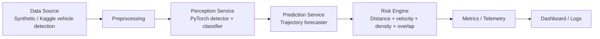

# Autonomous Driving ADAS Stack

Production-style reference implementation for a real-time ADAS pipeline with:

- synthetic or Kaggle vehicle-detection data ingestion
- perception microservice for object detection and scene reconstruction
- prediction microservice for short-horizon trajectory forecasting
- risk microservice for frame-level risk scoring
- async streaming orchestrator with latency tracking

## Architecture



## Services

- `perception-service`: frame decoding, object detection, scene structuring
- `prediction-service`: trajectory forecasting and collision likelihood estimation
- `risk-service`: real-time risk scoring from scene and forecast outputs
- `pipeline-orchestrator`: HTTP microservice mode or bounded in-process queue mode with backpressure
- `pipeline-benchmark`: compares HTTP and queue modes on the same frame set
- `bootstrap-stack`: trains, evaluates, and launches the stack in one command

## Run locally

```bash
pip install -e .[dev]
python -m adas_stack.training.perception_train --data-root /path/to/vehicle-detection --output checkpoints/perception.pt
python -m adas_stack.training.prediction_train --output checkpoints/prediction.pt
python -m adas_stack.evaluation.perception_eval --data-root /path/to/vehicle-detection --checkpoint checkpoints/perception.pt
python -m adas_stack.evaluation.perception_eval --data-root /path/to/vehicle-detection --checkpoint checkpoints/perception.pt --max-samples 20
python -m adas_stack.evaluation.prediction_eval --checkpoint checkpoints/prediction.pt
uvicorn adas_stack.services.perception_service.app:app --port 8001
set PREDICTION_CHECKPOINT=checkpoints/prediction.pt
uvicorn adas_stack.services.prediction_service.app:app --port 8002
uvicorn adas_stack.services.risk_service.app:app --port 8003
set PIPELINE_TRANSPORT=queue
set DATASET_ROOT=/path/to/vehicle-detection
python -m adas_stack.pipeline.orchestrator --frames 60 --target-fps 15
python -m adas_stack.pipeline.benchmark --frames 60 --target-fps 15
python -m adas_stack.workflows.bootstrap_stack --data-root /path/to/vehicle-detection --output-dir ./build
```

The benchmark command expects the three HTTP services to be running first.

## Kaggle download

The primary public dataset source for this version is the Kaggle vehicle-detection dataset:

```bash
python -m pip install kagglehub
python -c "from adas_stack.common.vehicle_detection_dataset import download_kaggle_vehicle_detection; print(download_kaggle_vehicle_detection())"
```

## Resume Metrics

These are the latest numbers from this workspace on the Kaggle vehicle-detection dataset (`killa92/vehicle-detection-dataset`):

- Perception evaluation over all 270 samples: precision `0.1145`, recall `0.0697`, mean IoU `0.6881`
- Fast 20-sample perception check: precision `0.1698`, recall `0.1169`, mean IoU `0.6980`
- HTTP benchmark over 12 frames: detection accuracy `0.3917`, prediction ADE `49.9950`, collision Brier `0.1324`
- Queue benchmark over 12 frames: detection accuracy `0.3917`, prediction ADE `50.0399`, collision Brier `0.1503`

Fast subset command:

```bash
python -m adas_stack.evaluation.perception_eval --data-root /path/to/vehicle-detection --checkpoint checkpoints/perception.pt --max-samples 20
```

## Data flow

1. Synthetic or dataset-backed frames are normalized into a common envelope.
2. The perception service decodes images and emits structured detections.
3. The prediction service consumes derived object tracks and outputs future trajectories.
4. The risk engine combines spatial distance, relative velocity, density, and trajectory overlap into a scalar risk score.
5. The orchestrator records latency and quality metrics per stage.
6. Queue mode applies bounded buffering so downstream slowness propagates backpressure to the source.

## Bottlenecks and latency controls

- image decoding and serialization overhead
- perception model inference time
- prediction model context-window size
- network hops between services
- queueing delays when frame rate exceeds service throughput

Latency reduction strategies:

- batch adjacent frames only when the object count is stable
- keep payloads compact with base64-encoded JPEG rather than raw arrays
- use GPU-backed inference for perception and forecasting
- cache track state between frames to avoid recomputing scene history
- cap queue depth and apply backpressure to preserve real-time freshness

## Dataset Attribution

This stack can be trained and evaluated on the Kaggle vehicle-detection dataset. When you use that dataset or derived data, preserve the original attribution and comply with the published license terms.

Citation:

```bibtex
@dataset{kaggle_vehicle_detection,
  title = {Vehicle Detection Dataset},
  author = {Killa92},
  year = {2024}
}
```

License summary:

- Attribution is required in the manner specified by the dataset authors.
- Use must follow the Kaggle dataset card and its CC BY-NC-SA 4.0 terms.
- Check the Kaggle dataset card and the upstream BDD100K license before redistribution.

